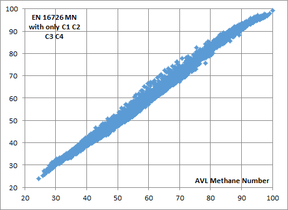

# Methane Number EN16726  

## Methane Number according to EN16726 with MWM corrections as a VBA Function for Excel.  

- Optimization performed with a very, **very**, simple stochastic pathfinding algorithm.  
- While the AVL Method only consider components with less than 5C-. This method manages components with less than 7C-. 
- Also, the impact of CarbonMonoxide, Butadiene, Butylene, Ethylene, Propylene are taken into account in this algorithm.
- Good AVL MN correlation if you only use less than 5C- components and no inerts.*(This is requested by some Engines Manufacturers)*  

  

- This algorithm is especially useful in mixtures with high Hydrogen content.  

## The formula will have the following syntax.  

=MethaneNumberMWM(Methane,Ethane,Propane,iButane,nButane,ipentane,npentane,Hexanes,Nitrogen,CarbonDioxide,Hydrogen,CarbonMonoxide,Butadiene,Butylene,Ethylene,Propylene,HydrogenSulphide)

### All the components are requested in Volume Percent

distributed on an “AS IS” BASIS, WITHOUT WARRANTIES OR CONDITIONS OF ANY KIND, either express or implied.
